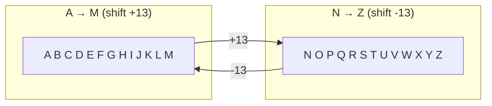
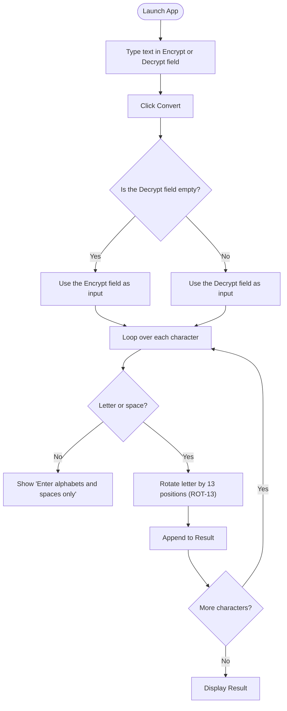
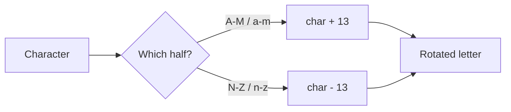

# 🔐 Encryption / Decryption App (ROT‑13)

A small **Java Swing** desktop application that encrypts and decrypts text using the classic
**ROT‑13** substitution cipher. Type a message, hit **Convert**, and watch each letter rotate 13
places around the alphabet. Because ROT‑13 is its own inverse, the *same* operation both scrambles
and unscrambles text.

---

## ✨ Features

- 🔤 Encrypt plain text into ROT‑13 cipher text
- 🔓 Decrypt ROT‑13 cipher text back to plain text
- 🖱️ Clean two‑field Swing GUI (`Encrypt`, `Decrypt`, `Result`)
- 🧹 **Clear** button to reset the form
- 🛡️ Input validation — only letters and spaces are accepted

---

## 🧭 What is ROT‑13?

ROT‑13 ("rotate by 13 places") shifts every letter 13 positions in the 26‑letter alphabet.
Since `26 ÷ 2 = 13`, applying it twice returns the original text — encryption and decryption are the
**same transformation**.



**Example:** `HELLO` → `URYYB` → `HELLO`

---

## 🔄 How It Works

The app decides whether to encrypt or decrypt based on which text field you filled in. Each
character is checked, then shifted using its ASCII value.



### The rotation rule
For the first half of each alphabet case (`A–M` / `a–m`) the code **adds 13**; for the second half
(`N–Z` / `n–z`) it **subtracts 13**. This keeps the result inside the letters `A–Z`/`a–z`.



---

## 🚀 Getting Started

### Prerequisites
- **JDK 8+**

### Run it
Open the project in **IntelliJ IDEA** (an `.iml` file is included) and run `Cipher.main()`, or use
the command line:

```bash
# from the repository root
javac -d out src/Cipher.java
java -cp out Cipher
```

A 500×500 window opens with the encrypt/decrypt fields and the **Convert** / **Clear** buttons.

---

## 🗂️ Project Structure

```
Encryption-Decryption-App/
├── src/
│   └── Cipher.java     # Swing UI + ROT-13 encrypt/decrypt logic
└── App.iml             # IntelliJ IDEA module file
```

### Key components inside `Cipher.java`
| Element | Responsibility |
|---------|----------------|
| `Cipher` (extends `JFrame`) | Builds the window and lays out the panels |
| `convertButton` listener | Runs the ROT‑13 transform and shows the result |
| `clearButton` listener | Empties all text fields |
| Character check | Ensures only alphabets and spaces are processed |

---

## 💡 Possible Enhancements
- Support a configurable shift (turn ROT‑13 into a full **Caesar cipher**)
- Preserve digits and punctuation instead of rejecting them
- Add copy‑to‑clipboard for the result

---

> ⚠️ **Note:** ROT‑13 provides *no real security* — it is a reversible obfuscation used for learning
> and for hiding spoilers, not for protecting sensitive data.
