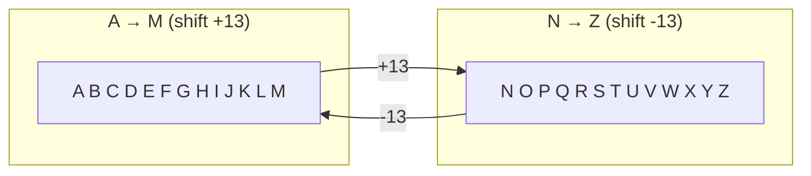
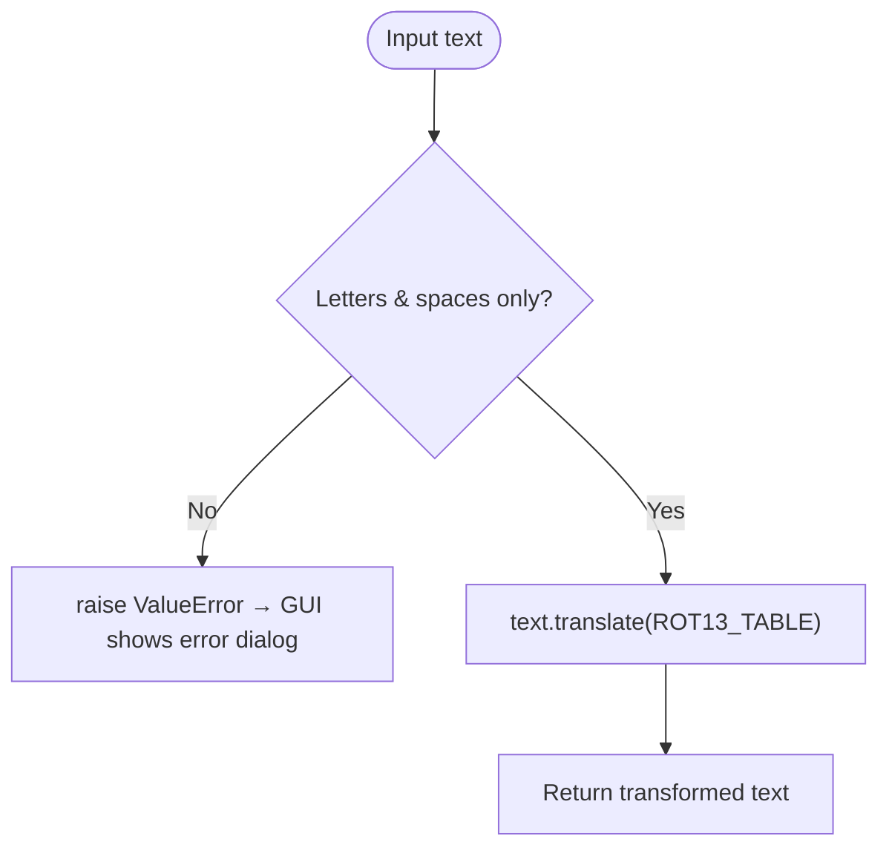
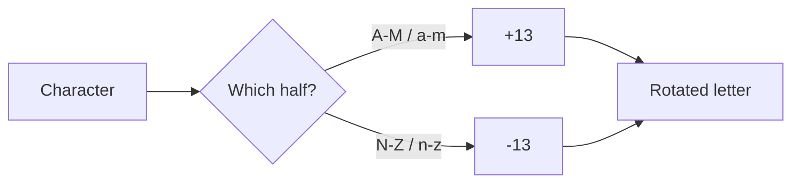

# 🔐 Encryption / Decryption App (ROT‑13)

A small **Python** project that encrypts and decrypts text using the classic **ROT‑13**
substitution cipher. It ships with **two front ends** on top of one tiny, tested core module:

- 🖥️ a **Tkinter GUI** (`main.py`) — type a message, hit **Convert**, watch each letter rotate
- ⌨️ a **command-line interface** (`python -m rot13.cli`) — great for pipes and scripting

Because ROT‑13 is its own inverse, the *same* operation both scrambles and unscrambles text.

---

## ✨ Features

- 🔤 Encrypt plain text into ROT‑13 cipher text
- 🔓 Decrypt ROT‑13 cipher text back to plain text
- 🖱️ Clean Tkinter GUI (`Encrypt`, `Decrypt`, `Result` fields + `Convert` / `Clear`)
- ⌨️ Scriptable CLI that reads arguments or standard input
- 🛡️ Input validation — only letters and spaces are accepted (raises `ValueError`)
- 🧪 Unit tests for the core cipher (`unittest`)

---

## 🧭 What is ROT‑13?

ROT‑13 ("rotate by 13 places") shifts every letter 13 positions in the 26‑letter alphabet.
Since `26 ÷ 2 = 13`, applying it twice returns the original text — encryption and decryption are the
**same transformation**.



**Example:** `HELLO` → `URYYB` → `HELLO`

---

## 🔄 How It Works

The core lives in `rot13/cipher.py`. Rather than looping character-by-character, it builds a single
**translation table** once with `str.maketrans` and applies it with `str.translate` — fast, concise
and Pythonic.

```python
_ROT13_TABLE = str.maketrans(
    string.ascii_uppercase + string.ascii_lowercase,
    (string.ascii_uppercase[13:] + string.ascii_uppercase[:13]
     + string.ascii_lowercase[13:] + string.ascii_lowercase[:13]),
)

def rot13(text: str) -> str:
    if not is_valid(text):
        raise ValueError("Enter alphabets and spaces only!")
    return text.translate(_ROT13_TABLE)
```



### The rotation rule
For the first half of each alphabet case (`A–M` / `a–m`) the mapping effectively **adds 13**; for the
second half (`N–Z` / `n–z`) it **subtracts 13**. This keeps every result inside `A–Z` / `a–z`.



---

## 🚀 Getting Started

### Prerequisites
- **Python 3.9+** (`python --version`). Tkinter ships with the standard CPython installer.

### Run the GUI

```bash
# from the repository root
python main.py
```

A small window opens with the encrypt/decrypt fields and the **Convert** / **Clear** buttons.
Whichever field you fill in is used as the source text.

### Run the CLI

```bash
python -m rot13.cli "Hello World"     # -> Uryyb Jbeyq
echo "Uryyb Jbeyq" | python -m rot13.cli

# or, after `pip install .`, use the installed entry point:
rot13 "Hello World"
```

### Run the tests

```bash
python -m unittest discover -s tests -v
```

---

## 🗂️ Project Structure

```
Encryption-Decryption-App/
├── main.py                  # Entry point — launches the Tkinter GUI
├── pyproject.toml           # Packaging + `rot13` console script
├── rot13/
│   ├── __init__.py
│   ├── cipher.py            # Core ROT-13 transform + validation
│   ├── cli.py               # argparse command-line interface
│   └── gui.py               # Tkinter GUI (CipherApp)
└── tests/
    └── test_cipher.py       # unittest cases for the core cipher
```

---

## 🧰 Tech Stack

- **Python 3** — standard library only (no third-party dependencies)
- **Tkinter** — the desktop GUI
- **argparse** — the command-line interface
- **unittest** — tests for the core cipher

---

## 💡 Possible Enhancements
- Support a configurable rotation amount (ROT‑N, e.g. Caesar cipher)
- Preserve digits and punctuation instead of rejecting them
- Add copy‑to‑clipboard for the result in the GUI

---

> ⚠️ **Note:** ROT‑13 provides *no real security* — it is a reversible obfuscation used for learning
> and for hiding spoilers, not for protecting sensitive data.
